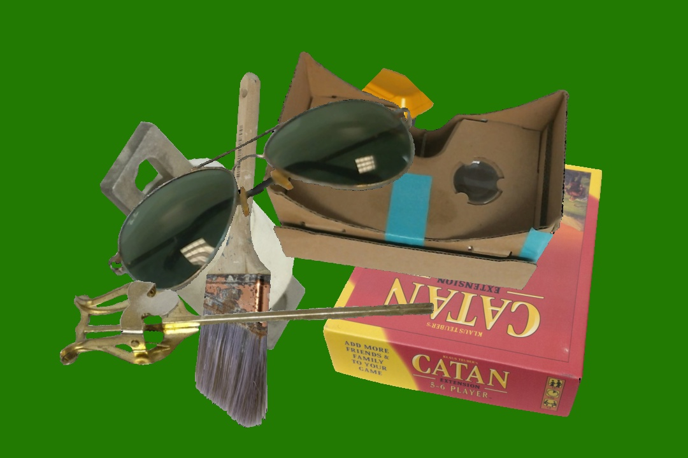
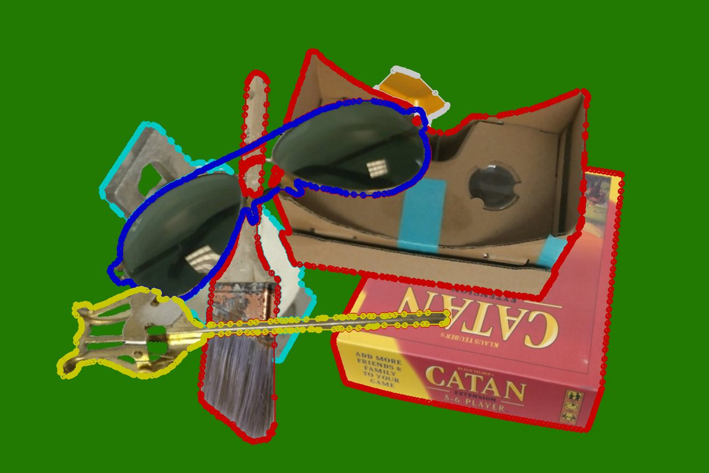
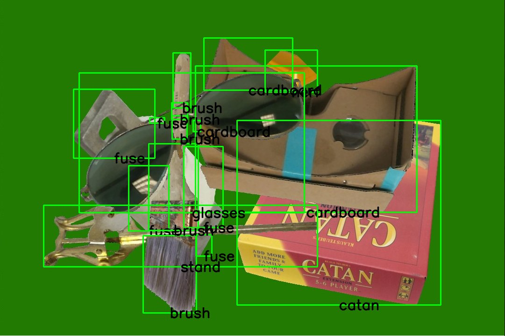
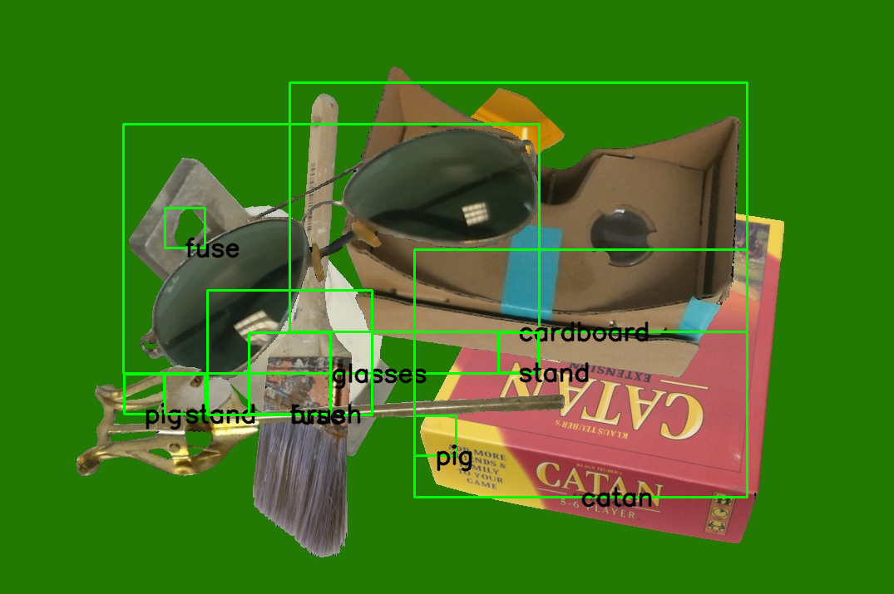

# Declutterization
## Nathan Vance

There were several questions that this project attempts to answer, copied below for reference:

 1. What is the minimum amount of information necessary to robustly identify everyday objects within a tote?
 2. How much occlusion can be present on a single object yet still result in a positive high confidence match?
 3. What is the minimum amount of information necessary in the matching database and how small can the footprint of the database be?
 4. What is the robustness of the proposed methods to varying illumination, scale, rotation and selected properties of sensors?
 5. Is training necessary? If so, what is the least amount of training required to robustly match occluded objects?
 6. Is the approach scalable to large databases? If so, how can we test this?
 7. Could the approach extend to classes of objects or even novel objects?

This project focuses on questions 1 and 5, creating a system that uses a small set of images of individual objects to generate synthetic data, then perform classification using an SVM, thus achieving low training (as compared to neural networks).

The solution is in three parts: synthetic image generation (i.e., **clutterization**), **training**, and **inference**.

## Clutterization

Synthetic data is generated using the *clutterizer*. This system reads in images of individual objects with transparent backgrounds. Then seven objects are randomly selected, resized, rotated, and layered onto a randomly colored scene. The system uses masks of the alpha channel to keep a record of how objects occlude each other. Finally, the resulting image is saved along with a labelme formatted json file containing object masks and labels.



Shown here is an example of generated clutter as is produced by the Clutterizer. With the labelme ground truth included, the scene is as follows:



Finally, COCO bounding boxes are used for the evaluation. These are displayed as follows:



This technique was developed so that the system would need only a small number of images of the individual objects for the training process.

## Training

Both training and inference involve a sliding window sized 100x100 px with a stride of 50 px. At each location a feature vector is generated containing the following information:

 * Uniform LBP histogram with number of points and radius as: (24, 8), (16, 4), (12, 2), and (8, 1).
 * Color histogram calculated over the Hue channel of the HSV colorspace and quantized into 32 bins.
 * Variance normalized to [0, 1].

These features are used to train an SVM using the RBF kernel for categorization, and a KNN-based Local Outlier Factor model to determine outliers. These models were chosen so that the system would not require extensive training.

70 synthetic images are used to train the model, and 30 are used to validate the trained model.

## Inference

Once the model has been trained, the same sliding window technique that was used in training is used in inference. For each window, the SVM is used to perform a classification, and then the confidence of the classification is as follows:

```python
confidence = max(compareHistogramData(histogram1, histogram2) for histogram2 in histograms[object]) * LocalOutlierFactor.confidence(histogram1)
```

Where:

 * `compareHistogramData` calculates IoU for two histograms
 * `histogram1` is the histogram calculated for the current sliding window
 * `histograms` are the histograms seen in training organized by object
 * `object` is the object that was inferred by the SVM
 * `LocalOutlierFactor.confidence()` calculates the percent confidence that a histogram is an inlier

Finally, the resulting confidence is compared to a threshold value to determine if it is a positive match or should be considered image background.

Once the individual sliding window positions have been categorized, adjacent regions belonging to the same object are merged and the results are written to a COCO formatted file. The inferred results for a synthetic example are shown below.



## Experiments

To evaluate the system, the COCO results were compared with the ground truth using the official `pycocotools` python implementation. Furthermore, IoU was calculated for each individual object as well as the cumulative IoU, which was calculated by the sum of the individual intersections over the sum of the individual unions.

The first round of experiments investigated the best kernel for the SVM. The results are shown below. It was found that the RBF kernel outperforms the other evaluated kernels on the validation set, so it was used for further tests.

[SVM kernel](solution_final/plots/kernelIoU.png)

The second round of experiments was to determine the optimal LBP setting. In the plot below, the LBP setting corresponds to the LBP (number of points, radius) pair omitted, where 4 is all of them included. #TODO: Make labels on graph tell this story better.

[LBP setting](solution_final/plots/lbpIoU.png)

There was further round of tests on completely unknown data, which did not contain the objects that the system was trained on. An example result is below.

[Test Result](presentation/unknown1.png)

## Accuracy

The accuracy metric used was IoU. The system achieved an IoU of 10.19%. The breakdown by object is as follows:

IOU for object stand: 0.0  
IOU for object brush: 0.09467161706309668  
IOU for object glasses: 0.0  
IOU for object router: 0.05399777229844433  
IOU for object pig: 0.0  
IOU for object vader: 0.0  
IOU for object nerf: 0.33372582395790296  
IOU for object catan: 0.2274421483834286  
IOU for object cardboard: 0.1305853936545369  
IOU for object fuse: 0.005283190421766054  
Total IOU: 0.10187927021520946

In the object layouts evaluated, the stand, glasses, and pig were never observed. Vader was observed but never correctly located by the system.

In addition to IoU, the Precision and Recall reported by the COCO software was recorded. The precision for IoU=0.50 was 0.003, and recall was 0.014.

Finally, for the unknown test, the IoU was 0 because there was no valid intersection yet there was a positive union.

## Discussion


